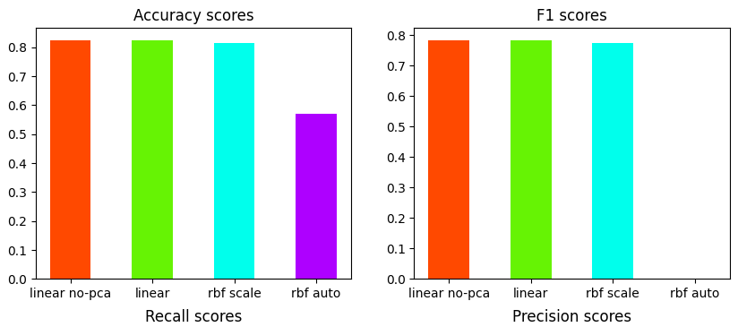

# 🌍 Disaster Alert System via Twitter Analysis 🚨

An NLP project designed to detect natural disasters from Twitter (X) posts.

## Scenario 🚨
*Following recent natural disasters, the government has decided to enhance the early warning and evacuation system by leveraging posts from X (formerly Twitter).*

The Challenge:
- 🌪️ **Social Media Noise**: Thousands of tweets mention keywords like "flood" or "earthquake" daily, but most are non-emergencies (e.g., memes, metaphors, or jokes).
- 🆘 **Importance of Precision**: Authorities need to act fast on actual disasters (target=1) but can’t afford false alarms that drain emergency resources.

## 🔍 Key Steps  

### 1. EDA & Text Preprocessing 🧹  
- Identified data imbalances and inconsistencies.  
- Removed emojis, URLs, hashtags, and handles.  
- Expanded abbreviations (e.g., "gov" → "government") to reduce model confusion.  

### 2. TF-IDF Vectorization 📊  
- Converted text to numerical features for ML modeling.  

### 3. Dimensionality Reduction with PCA 🎯  
- Reduced features while retaining **95% of explained variance**.  

### 6. Model Training & Evaluation 🤖  
- **Support Vector Machine (SVM)** tested with linear, RBF, and polynomial kernels.  
- **Naive Bayes** as a baseline for comparison.  
- Optimized hyperparameters.  

## 📈 Results  
- **Best Model**: SVM with RBF kernel achieved **77% F1-score** (balance of precision and recall). 🏆
- **Precision Focus**: Optimized for scenarios requiring minimal false alarms (direct emergency dispatch). 🚒
- **Recall Focus**: Suitable for systems with human review steps (maximize threat detection). 👁️

## 🛠️ Tech Stack  
**NumPy** · **pandas** · **Matplotlib** · **scikit-learn** 
